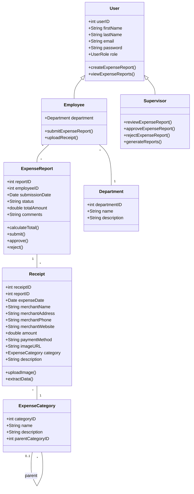

# EERIS Database Models

## Visual Diagram

## Models

### User
- `userID`: int (PK)
- `firstName`: string
- `lastName`: string
- `email`: string
- `password`: string
- `role`: enum (Employee/Supervisor)

### Employee (extends User)
- `departmentID`: int (FK)

### Supervisor (extends User)
No additional fields

### ExpenseReport
- `reportID`: int (PK)
- `employeeID`: int (FK)
- `submissionDate`: datetime
- `status`: string
- `totalAmount`: decimal
- `comments`: string

### Receipt
- `receiptID`: int (PK)
- `reportID`: int (FK)
- `expenseDate`: datetime
- `merchantName`: string
- `merchantAddress`: string
- `merchantPhone`: string
- `merchantWebsite`: string
- `amount`: decimal
- `paymentMethod`: string
- `imageURL`: string
- `categoryID`: int (FK)
- `description`: string

### ExpenseCategory
- `categoryID`: int (PK)
- `name`: string
- `description`: string
- `parentCategoryID`: int (FK, nullable)

### Department
- `departmentID`: int (PK)
- `name`: string
- `description`: string

